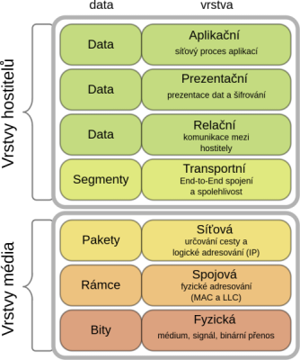
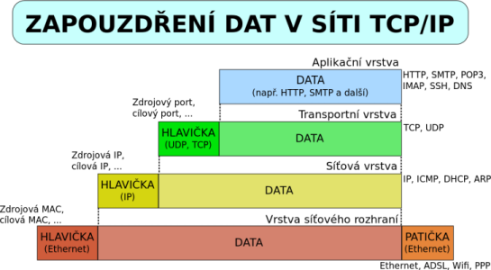

# 17. Protokoly

> ISO/OSI, Vrstvy \
> TCP/IP \
> IP adresa \
> Maska

## Model ISO/OSI:

### Definice

- (Interantional Organization for Standardization/Open Systems Interconnection)
- Model standartizace počítačových sítí
- Nespecifukuje konkrétní implementaci síťového "stacku", je pouze abstrakním modelem

### Vrstvový model

- Rozděluje síťové řešení 7 vrstev
- Každá vrstva má jasně danou funkci, využívá činnost nižší vrsty, své služby poskytuje vyšší vrstvě
- V praxi není na 100% dodržováno

#### Fyzická vrstva

- Fyzické propojení mezi počítači - Kabely (např. Ethernet), konektory, huby, repeatery, síťové karty...
- Definuje elektrické vlastnosti těchto zařízení
- Zařizuje synchronizaci, kódování dat na elektrické impulzy (nebo světlo), synchronizaci...

#### Linková vrstva

- Propojení sousedních systémů
- Spojuje data do větších celků (stovky bajtů)
- Kontroluje integritu dat, řídí přenosovou rychlost
- Zařízení jako switche a mosty

#### Síťová vrstva

- Propojení systémů, které spolu přímo nesousedí
- Umožňuje překlenut rozdílné technologie nižších vrstev
- Členění dat různé délky do packetů

#### Transportní vrstva

- Přenos dat mezi koncovými počítači
- Sestavení dat do/z packetů
- Kontrala chyb, rozpoznání příjemce packetů (programu)
- Protokoly UDP, TCP

#### Relační vrstva

- Vytváří, kontroluje a ukončuje spojení mezi počítači
- Zařuzuje obnovené spojení, osnamování vyjímečných stavů...

#### Prezentační vrstva

- Překládá data podoby, které rozumí aplikace
- Zajišťuje šiforání, komprimaci, konvertování dat

#### Aplikační vrstva

- Poskytuje aplikacím přístup k síti
- Uživatel k ní má přístup
- Protokoly jako HTTPS, HTTP, FTP, SMTP, DNS

## TCP/IP

- = Transmission Control Protocol/Internet Protocol
- Sada protokolů pro počítačové sítě, používá internet

### Vrstvový model

- Kvůli složitosti rozdělen na 4 vrstvy
- Umožňuje snadno vyměnit implementaci jedné vrstvy za jinou

#### Vrstva síťového rozhraní

- Fyzické přenosové médium - Přímé vysílání a příjem
- Implementace sítě Ethernet, Token ring

#### Síťová vrstva (IP)

- Aresace, směrování packetů po celé sít
- Protokol IP
  - Nezaručuje přenos dat a nekontroluje je, rozlišuje pouze síťová rozhraní
  - Každý packet může jít jinou cestou - Nepředvídatelná poba přenosu
- Kontroluje vrstvu síťového rozhraní

#### Transportní vrstva

- Poskytuje protokoly UDP a TCP
  - UDP (User Datagram Protocol)
    - Nespolehlivý, ale jednoduchý
  - TCP (Transmission Control Protocol)
    - Spolehlivý přenus a zaručuje přimutí packetů ve správném pořadí
    - Fáze navázíní spojení, přenosu dat a ukončení spojení

#### Aplikační vrstva

- Protokoly, které slouží k přenosu konkrétních dat
  - IMAP, SMTP (email)
  - HTTP(S)
  - DNS (Domain Name System – převod IP a domén)
  - FTP (přenos souborů)

## IP adresa

### Definice

- MAC adresa - (Teoreticky) unikátní označení síťového rozhraní
- IP adresa - Číslo, které označuje síťové rozhraní v síti
- Dynamická x statická
  - Statick IP adresa je na pevno nastavéná
  - Dynamickou IP adresu přiděluje DHCP server na omezený čas
- Lokální x veřejná
  - Lokální je viditelná uvnitř lokální sítě (např. na domácí wifi), unikátní
  - Veřejná je viditelná pro vnější svět, sdílí všechny počítače v lokální síti

### IPv4

- 32 bitů
- `x.x.x.x`, `x` je od 0 do 255
- Soukromé adresy – `192.168.x.x`, `0.0.0.0`
- Je jich málo, proto se přechází na IPv6

### IPv6

- 128 bitů
- `x:x:x:x:x:x:x:x`, `x` je od 0 do 65536 (4 hexadecimální číslice 0000-FFFF)
- Soukromé adresy – `fc00::`

### Maska

- Rozděluje síť na podsítě
- Např. maska `255.255.0.0`
  - Aby se IP adresy viděly, musí se shodovat jejich první dvě "políčka"
