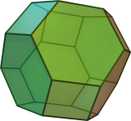

# 11. Mnohostěny

> Charakterizovat jednotlivé mnohostěny do kategorií dle jejich společných vlastností. \
> Odvodit vztahy pro výpočty objemů a obsahu povrchů. \
> Řešit polohové vlastnosti útvarů v prostoru a určit jejich společné množiny bodů, vzdálenosti či odchylky.

## Definice

- Mnohostěn = polyedr
- Troj (případně více) rozměrné těleso
- Povrch se skládá z konečně mnoha mnohoúhelníkových stěn
- Hrana - Úsečka, ve které se potkávají 2 stěny
- Vrchol - Bod, ve kterém se potkávají alespoň 3 hrany
- Nazývají se podle počtu stěn: čtyřstěn (tetraedr), pětistěn(pentaedr), ...

### Konvexní mnohostěn

- $t$ - Konvexní těleso
- Úsečka mezi každými 2 body konvexního tělesa $t$ je obsažena v tělesu $t$
  - $\forall (A, \ B \in t); \ \overline{AB} \in t$
- $\iff$ $t$ je průnikem konečně mnoha poloprostorů

### Eulerova věta

- Vztah mezi počtem vrcholů $v$, hran $h$ a stěn $s$ kovexního mnohostěnu
- $v - h + s = 2$

#### Obsah povrchu

## Význačné mnohostěny

### Jehlan

- Tvořený podstavou, hlavním vrcholem a trojúhelníkovými stěnami, sdílející hranu s podstavou a bod s hlavním vrcholem
- Jmenují se podle počtu trojúhelníkových stěn - trojboký, čtyřboký, ...
- Objem - $V = \frac{1}{3} S_p \cdot v$
  - $S_p$ - Obsah podstavy
  - $v$ - Výška
- Obsah - $S = S_p + S_q$
  - $S_p$ - Obsah podstavy
  - $S_q$ - Obsah pláště

### Hranol

- Mnohostěny tvořené dvěma shodnými, stejně orientovanými a v různých vzájemně rovnoběžných rovinách ležícími mnohoúhelníkovými stěnami (podstavami) a rovnoběžníkovými stěnami, sdílecící hranu s podstavou
- Objem: $V = S_p \cdot v l$
  - $S_p$ - Obsah podstavy
  - $v$ - Výška
- Obsah - $S = 2 \cdot S_p + S_q$
  - $S_p$ - Obsah podstavy
  - $S_q$ - Obsah pláště

## Pravidelné mnohostěny

- Pokud z každého vrcholu vycházi stejný počet hran, každá stěna je ohraničena stejným počtem hran a jsou navzájem shodné je mnohostěn kombinatoricky pravidelný
- Pokud jsou navíc stěny pravidelné mnohoúhelníky je (metricky) pravidelný

### Platónská tělesa

- Z 1 typu pravidelných mnohoúleníků
- Ze všech vrchlů vychází stejný počet hran

#### Příklady

- Čtyřstěn - Stěny jsou trojůhelníky
- Šestistěn (krychle)- Stěny jsou čtverce
- Osmistěn - Stěny jsou trojůhelníky
- Dvanáctistěn - Stěny jsou pětiúhelníky
- Dvacetistěn - Stěny jsou trojúhelníky

### Archimédovská tělesa

- Vysoce symetrický, polopravidelný konvexní mnohostěn
- Ze 2, nebo více typů pravidelných mnohoúhelníků
- Např. komolý osmistěn

