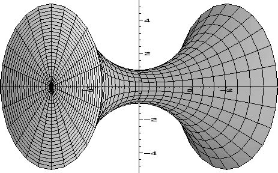
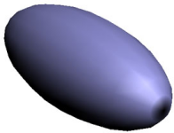
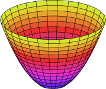

# 12. Rotační tělesa

> Charakterizovat jednotlivá tělesa s využitím pojmů rotace a osa souměrnosti. \
> Odvodit vztahy a vypočítat jejich objemy a povrchy. \
> Rozlišit části koule a kulové plochy.

## Definice

- Trojrozměrné těleso vzniklé rotací rovinného útvaru (křivkou) kolem přímky
- Narozdíl od (konvexních) mnohostěnů nejsou "hranatá", nejdou vyjádřit průnikem konečně mnoha poloprostorů

### Objem rotačního tělesa

- Pro jednoduchá rotační tělesa elegantní vzorečky
- Pokud je přímkou, okolo které rotujeme, osa $x$ a rotovanou křivku lze vyjádřit spojitou $f$ na intervalu $\langle a, \ b \rangle$ spojitou, můžeme využít integrální počet
  - Rotační těleso rozřežeme na limitně tenké komolé kužely (tedy válce), jejichž objemy posčítáme
  - $V = \pi \int^b_a f (x) ^2 \ dx$
  - [Odvvození](http://mdg.vsb.cz/portal/m2/kapitoly/kapitola_3_3.pdf)

### Povrch pláště rotačního tělesa

- Pro jednoduchá rotační tělesa elegantní vzorečky
- Pokud je přímkou, okolo které rotujeme, osa $x$ a rotovanou křivku lze vyjádřit funkcí $f$ na intervalu $\langle a, \ b \rangle$ spojitou, nezápornou a se spojitou derivací, můžeme využít integrální počet
  - Vyjdeme z [délky křivky pomocí integrálu](../24/_.md#d%C3%A9lka-k%C5%99ivky-pomoc%C3%AD-integr%C3%A1lu) - $L = \int^b_a \sqrt{1 + (f'(x))^2} \ dx$
  - Rotační těleso rozřežeme na limitně tenké komolé kužely, obsahy jejich plášťů posčítáme
  - $S_P = 2 \pi \int^b_a f(x) \sqrt{1 + (f'(x))^2} \ dx$
  - Plochu podstav tvoří kružnice o poloměru $f(a)$ a $f(b)$
  - [Odvození](http://mdg.vsb.cz/portal/m2/kapitoly/kapitola_3_4.pdf)

## Význačná rotační tělesa

### Rotační kužel

### Válec

### Koule (Sféra)

### Elipsoid

- Vznikne rotací elipsy

### Hyperboloid

- Vznikne rotací hyperboly
- Hyperbolická lobačovského geometrie

### Paraboloid

- Vznikne rotací paraboly
- Využívají parabolické antény (všechny signály odráží do 1 bodu)

### Torus (Anuloid)

- "Donut"
- Vznikne rotací kružnice

### Gabrielův roh

- Těleso, který má nekonečných povrch, ale konečný objem
- Vznikne rotací funkce $y = \frac{1}{x} \land x \ge 1$ (ramene hyperboly) kolem osy $x$

