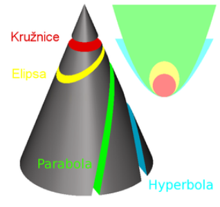
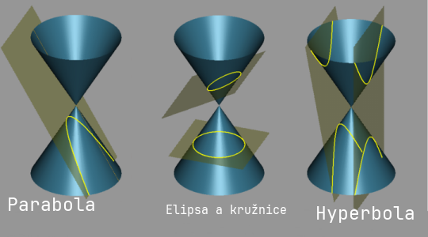
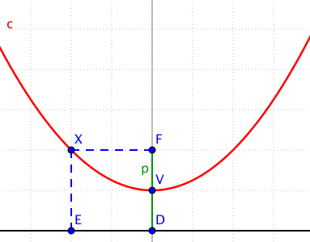
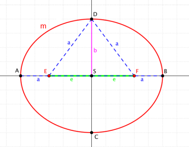

# 14. Kuželosečky, elipsa

> Vysvětlit vztah mezi řezy kužele a vznikem jednotlivých křivek. \
> Elipsa jako množina bodů daných vlastností. \
> Charakterizovat a načrtnout elipsu, popsat vlastnosti, zapsat a rozlišit možná analytická vyjádření rovnice elipsy. \
> Rozlišit vzájemné polohy přímky a elipsy.

## Kuželosečky

### Definice

- Kuželosečka je křivka, která vznikne průnikem roviny s pláštěm rotačního kuželu (rovina neprochází vrcholem kuželu)
- Úhel mezi rovinou řezu a osou kužele je $\varphi$
- Úhel mezi přímkou na plášti kužele a osou kužele je $\alpha$

### Druhy kuželoseček

#### Kružnice

- Vznikne průnikem pláště kuželu s rovinou kolmou na osu symetrie rotačního kuželu
- Množina všech bodů s konstatní vzdáleností od bodu
- $\varphi = 0$

#### Elipsa

- Vznikne průnikem pláště kuželu s rovinou, která svírá s osou rotačního kuželu úhel menší než $90°$ a větší než polovina vrcholového úhlu kuželu
- Množina všech bodů s konstatním součetem vzdáleností od dvou bodů (ohnisek)
- $\varphi \in (0 ; \ \alpha)$

#### Parabola

- Vznikne průnikem pláště kuželu s rovinou, která je rovnoběžná s povrchovou přímkoupláště kuželu
- Množina všech bodů s konstantním vzdáleností od bodu (ohniska) a přímky (řídící přímky), na které bod neleží
- $\varphi = \alpha$

#### Hyperbola

- Vznikne průnikem pláště kuželu s rovinou, která svírá s osou rotačního kuželu úhel menší než než polovina vrcholového úhlu kuželu - rovina je roznoběžná se dvěmi povrchovými přímkami kuželu
- Množina všech bodů s konstantním rozdílem vzdáleností od dvou bodů (ohnisek)
- $\varphi \in ( \alpha ; 90 \rangle$

#### Degenerované kuželosečky

> Za kuželosečku bývá často považován také průnik kuželové plochy s rovinou procházející vrcholem kuželové plochy. \
> Takovéto kuželosečky označujeme jako degenerované (nevlastní, singulární), neboť podle polohy roviny a osy kuželové plochy dochází k redukci kuželosečky na bod, přímku nebo dvě přímky.

## Elipsa

### Definice

- Množina všech bodů s konstatním součetem vzdáleností od dvou bodů (ohnisek)

- Elipsa $m$
- Body $E$, $F$ - Ohniska elipsa $l$
- $k \in R^+$ - Konstanta
- Pro bod $X$ elipsy $m$ platí $|XE| + |XF| = k$;

### Pojmy

- Hlavní vrcholy - body $A$ a $B$
- Vedlejší vrcholy - body $C$ a $D$
- Střed - Bod $S$ ve středu úsečky $|EF|$
- Hlavní osa - Přímka, která prochází hlavními vrcholy
- Vedlejší osa - Přímka, která prochází vedlejšími vrcholy
- Hlavní poloosa ($a$) - Úsečka, která spojuje hlavní vrchol a střed ($|AS|$ a $|BS|$)
- Vedlejší poloosa ($b$) - Úsečka, která spojuje vedlejší vrchol a střed ($|CS|$ a $|DS|$)
- Excentricita (výstřednost) - $e$
  - Vzdálenost ohnisek od středu elipsy
  - $e = \frac{|EF|}{2} = |ES| = |FS|$
  - $e = \sqrt{a^2 - b^2}$

### Analytické vyjádření

- $S = [m; \ n]$ - Střed
- $a$ - Délka hlavní poloosy
- $b$ - Délka vedlejší poloosy
- Hlavní osa rovnoběžná s $o_x$ - $\frac{(x - m)^2}{a^2} + \frac{(y - n)^2}{b^2} = 1$
- Hlavní osa rovnoběžná s $o_y$ - $\frac{(x - m)^2}{b^2} + \frac{(y - n)^2}{a^2} = 1$

### Parametrické vyjádření

- $t \in <0, \ 2\pi>$ - parametr
- $x = a \cdot \cos{t}$
- $y = b \cdot \sin{t}$

### Vzorečky

- Polára z body $B = [x_0; \ y_0]$: $\frac{(x - m)(x_0 - m)}{a^2} + \frac{(y - n)(y_0 - n)}{b^2} = 1$
- Obsah - $S = \pi a b$
- Obvod - $o = 4 a E(e)$; $E$ - Úplný eliptický integrál druhého druhu
