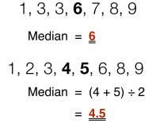

# 19. Statistika a pravděpodobnost

> Definovat pojmy náhodný jev, jistý jev, nemožný jev, opačný jev, nezávislost jevů, sjednocení a průnik jevů. \
> Zapsat a vysvětlit vztah pro pravděpodobnost náhodného jevu a pravděpodobnost sjednocení nebo průniku jevů. \
> Vysvětlit pojmy statistický soubor, rozsah souboru, statistická jednotka, statistický znak, hodnota znaku, četnost a relativní četnost a jejich výpočet. \
> Vysvětlit a použít charakteristiky polohy a variability (průměry, modus, medián, percentil).

## Pravděpodobnost

- Pravděpodobnost náhodného jevu je číslo vyjadřující očekávatelnost určitého jevu $A$
- Vyjadřena reálným číslem $P(A) = \langle 0; \ 1 \rangle $, případně v procentech
  - $P(A) = 0 = 0 \\%$ - Nemožný jev
  - $P(A) = 1 = 100 \\%$ - Jistý jev

### Definice

#### Klasická definice pravděpodobnosti

- Jev $A$ musí splňovat předpoklady
  - Konečné množství možných výsledků
  - Všechny výsledky jsou stejně možné
  - Všechny výsledky se vzájemně vylučují
- Pravděpodobnost jevu $P(A) = \frac{n}{m}$
  - $n$ - Počet příznívých výsledků
  - $m$ - Počet všech výsledků

#### Geometrická definice pravděpodobnosti

- Jev $A$ musí splňovat předpoklady
  - Všechny výsledky jsou stejně možné
  - Všechny výsledky se vzájemně vylučují
- Když je nekonečně mnoho možných výsledků (např. házení šipkou)
- Vychází z porovnávání ploch (případně objemů,...)
- Pravděpodobnost jevu $P(A) = \frac{R}{S}$
  - $R$ - Obsah plochy reprezentující příznivý výsledek
  - $S$ - Obsah plochy reprezentující všechny možné výsledky

#### Statistická definice pravděpodobnosti

- Založena na praktickém experimentu, který $N$-krát opakujeme
- Pravděpodobnost jevu $P(A) = \frac{M}{N}$
  - $M$ - Pošet přiznivých výsledků pokusu
  - $N$ - Počet všech pokusů
- Čím větší počet pokusů, tím lepší přesnost

### Pojmy

#### Náhodný jev

- Výsledek náhodného pokusu, o kterém lze jednoznačně rozhodnout, zda nastal nebo nenastal

#### Jistý jev

- Nastane při každém pokusu, $P(A) = 1$

#### Nemožný jev

- Nenastane při žádném pokusu, $P(A) = 0$

#### Opačný jev

- Jev $\overline A$, opačný k jevu $A$, nastane vždy když jev $A$ nenastane
- $P(\overline A) = 1 - P(A)$

#### Nezávislost jevů

- Jevy $A$ a $B$ jsou nezávislé, pokud jejich pravděpodobnosti na sobě nezávisí

### Operace s pravděpodobnostmi

#### Sjednocení jevů

- Nastane alespoň jeden z jevů
- $A = B \cup C$ - Jev $A$ je sjednocení jevů $B$ a $C$
- $P(A \cup B) = P(A) + P(B) - P(A \cap B)$
- Příklad
  - $A = \set{\text{na kostce padne liché číslo}} = \set{\text{padne 1}} \cup \set{\text{padne 3}} \cup \set{\text{padne 5}}$

#### Průnik jevů

- Nastanou všechny z jevů
- $A = B \cap C$ - Jev $A$ je průnik jevů $B$ a $C$
- $P(A \cap B) = P(A) \cdot P(B)$
- Příklad
  - $A = \set{\text{má modrou a červenou ponožku}} = \set{\text{má červenou ponožku}} \cup \set{\text{má modrou ponožku}}$

## Statistika

- Vědní obor, který se zabývá sběrem, organizací, analýzou, interpretací a prezentací empirických dat

### Pojmy

#### Statistický soubor

- Množina všech objektů (statistických jednotek), které jsou předmětem statistického zkoumání

#### Statistická jednotka

- Jeden prvek statistického souboru, který zkoumáme

#### Statistický znak

- Vlastnosti statiscké jednotky, které zkoumáme

#### Hodnota znaku

- Kvantitativní
  - Číslo, případně vektor
  - Např. výška, váha, hustota
- Kvalitativní
  - Vyjádřen slovním popisem
  - Např. barva, vůně

#### Rozsah souboru

- Počet všech prvků ve statistickém souboru

### Charakteristické polohy a variability

#### Četnost

- Jak často se ve statistickém souboru vyskytuje určitá hodnota
- Příklad
  - $A = \set{1,1,1,2,2,4,6,8,9,15}$
  - Četnost $4$ v $A$ $=$ $1$

#### Relativní četnost

- Četnost vydělená rozsahem statistického souboru
- Příklad
  - $A = \set{1,1,1,2,2,4,6,8,9,15}$
  - Četnost $4$ v $A$ $=$ $\frac {1} {10}$

#### Modus

- Hodnota, která se ve statistickém souboru vyskytuje nejčastěji
- Příklad
  - $A = \set{1,1,1,2,2,4,6,8,9,15}$
  - Modus $A$ $=$ $1$

#### Medián

- Hodnota, která dělí řadu vzestupně seřazených výsledků na dvě stejně početné poloviny

#### Percentil (kvantil)

- $p$-procentní percentil je takové číslo, že $p \\%$ hodnot je menších nebo rovno tomuto číslu

#### Aritmetický průměr

- Součet hodnot vydělený jejich počtem
- Příklad
  - $A = \set{1,1,1,2,2,4,6,8,9,15}$
  - Aritmetický průměr $A$ $=$ $\frac{1}{|A|} \sum\limits_{i = 1}^{|A|} A_i = \frac {1+1+1+2+2+4+6+8+9+15}{10} = 4.9$

#### Geometrický průměr

- Geometrický průměr $n$ hodnot je $n$-tá odmocnina jejich součinu
- Využití
  - Výpočet průměrů ůrokú, finančního zisku
  - Výpočet [HDI](https://en.wikipedia.org/wiki/Human_Development_Index)
- Příklad
  - $A = \set{1,1,1,2,2,4,6,8,9,15}$
  - Geometrický průměr $A$ $=$ $\sqrt[n]{\prod\limits_{i = 1}^{|A|} A_i} = \sqrt[n]{1 \cdot 1 \cdot 1 \cdot 2 \cdot 2 \cdot 4 \cdot 6 \cdot 8 \cdot 9 \cdot 15} \approxeq 3.17$

#### Harmonický průměr

- Převrácená hodnota aritmetického průměru převrácených hodnot průměrovaných hodnot
- Využití
  - Počítání průměrné rychlosti
  - Odpor pararelně zapojených rezistorů

#### Kvadratický průměr (střední kvadratická hodnota)

- Odmocnina aritmetického průměru druhých mocnin hodnot
- Využití
  - Střední kvadratická rychlost molekul plynu
  - Efektivní hodnota střídavého napětí
