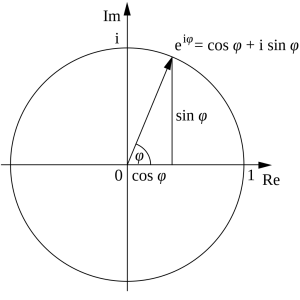

# 2. Množina komplexních čísel C

> Zavést množinu komplexních čísel. Zobrazit komplexní číslo v Gaussově rovině, vyjádřit komplexní číslo v algebraickém i goniometrickém tvaru. Interpretovat a určit opačné číslo, komplexně sdružené číslo, převrácenou hodnotu a absolutní hodnotu komplexního čísla. \
> Charakterizovat a použít početní operace s komplexními čísly v algebraickém i goniometrickém tvaru. \
> Charakterizovat a užít mocniny a odmocniny komplexních čísel v goniometrickém tvaru užitím Moivreovy věty. Řešit rovnice v oboru komplexních čísel.

### Definice

- Imaginární jednotka $i = \sqrt{-1}$
- Komplexní číslo $z \in C; \ z = [x;\ y]$ kde x je reálná a y imaginární část čísla
- Algebraický tvar $z = a + bi$
- Goinometrický tvar $z = |z|(cos(\varphi) + i\sin(\varphi))$
- $a = \frac{ \cos(\varphi)}{ |z|}, b = \frac {\sin(\varphi)} {|z|}$

### Gaussova (komplexní) rovina

### Pojmy a vlastnosti

<!-- prettier-ignore -->
- Goniometrický tvar
  - $z = |z|(\cos{\varphi} + i \sin{\varphi}) = |z| \cdot \frac{x}{|z|} \cdot i \frac{y}{|z|}=x+yi$
- Opačné číslo
  - Čísla $z$ a kněmu opačné číslo $-z$ jsou bodově symetrická vůči počátku
  - $z = x + yi$
  - $-z = -x - yi$
- Komplexně sdružené číslo
  - Čísla $z$ a kněmu komplexně sdružené číslo $\overline z$ jsou osově symetrická vůči reálné ose
  - $z = x + yi$
  - $\overline z = x - yi$

- Absolutní hodnota (vzdálenost od počátku)
  - $|z| = \sqrt{x^2 + y^2} = \sqrt{z \cdot \overline z}$
  - $|z|=|-z|=|\overline z|$

### Operace

- $z_1 = x_1+y_1i$; $z_2 = x_2+y_2i$
- $z_1+z_2=(x_1+y_1i)+(x_2+y_2i) = \underline{(x_1+x_2)+(y_1+y_2)i}$
- $z_1 \cdot z_2 = (x_1 + y_1i) \cdot (x_2+y_2i) = \underline{(x_1x_2-y_1y_2)+(x_2y_1+x_2y_1)i}$
- $|z_1|(\cos(\varphi_1) + i\sin(\varphi_1)) * |z_2|(\cos(\varphi_2) + i\sin(\varphi_2)) = |z_1||z_2|(\cos(\varphi_1 + \varphi_2) + i\sin(\varphi_1 + \varphi_2))$
- $\frac{z_1} { z_2} = \frac{z_1}{z_2} \cdot \frac{\overline {z_2}}{\overline {z_2}} = \frac{C}{R}$
- $|z_1|(\cos(\varphi_1) + i\sin(\varphi_1)) / |z_2|(\cos(\varphi_2) + i\sin(\varphi_2)) = \frac{|z_1|}{|z_2|}(\cos(\varphi_1 - \varphi_2) + i\sin(\varphi_1 - \varphi_2))$

### Moivreova věta

- $(\cos{x} + i \sin{x})^n = \cos{n x} + i \sin{n x}$
  - $x \in C$
  - $n \in Z$

### Eulerův vzorec

- $e^{i \varphi} = \cos{\varphi} + i \sin{\varphi}$

