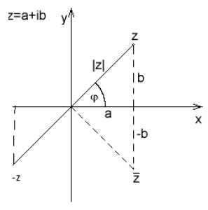

# 2. Množina komplexních čísel C

> Zavést množinu komplexních čísel. Zobrazit komplexní číslo v Gaussově rovině, vyjádřit komplexní číslo v algebraickém i goniometrickém tvaru. Interpretovat a určit opačné číslo, komplexně sdružené číslo, převrácenou hodnotu a absolutní hodnotu komplexního čísla. \
> Charakterizovat a použít početní operace s komplexními čísly v algebraickém i goniometrickém tvaru. \
> Charakterizovat a užít mocniny a odmocniny komplexních čísel v goniometrickém tvaru užitím Moivreovy věty. Řešit rovnice v oboru komplexních čísel.

### Definice

- Rozšíření reálných čísel tak, by každá polynomická rovnice měla řešení
- Imaginární jednotka $i = \sqrt{-1}$
- Komplexní číslo $z \in C; \ z = [x; \ y]$
  - $x$ - Reálná složka čísla
  - $y$ - Imaginární složka čísla
- Geometrická interpretace v gaussově rovině

#### Algebraický tvar

- Určuje číslo v kartézské soustavě souřadnic
- $z = a + bi$
  - $a$ - Reálná složka
  - $b$ - Imaginární složka

#### Goinometrický tvar

- Určuje číslo v polární soustavě souřadnic
- $z = a + bi = |z|(\cos(\varphi) + i\sin(\varphi))$
  - $\cos(\varphi) = \frac{a}{|z|}$ - Reálná složka
  - $\sin(\varphi) = \frac{b}{|z|}$ - Imaginární složka
- $|z|$ - Vzdálenost od počátku
- $\varphi$ - Orientovaný úhel mezi $z$ a počátkem

#### Exponenciální tvar

- Vychází z goniometrického tvary
- $z = |z|(\cos(\varphi) + i\sin(\varphi)) = |z| e^{i \varphi}$
- Eulerova rovnost
  - $e^{i \pi} + 1 = 0$

### Pojmy a vlastnosti

- Často se chovají komplexní čísla podobně jako reálná, ale např. chybí jednoznačně definovatelná relace uspořádání

#### Opačné číslo

- Čísla $z$ a kněmu opačné číslo $-z$ jsou bodově symetrická vůči počátku
- $z = a + bi$
- $-z = -a - bi$

#### Komplexně sdružené číslo

- Čísla $z$ a kněmu komplexně sdružené číslo $\overline{z}$ jsou osově symetrická vůči reálné ose
- $z = a + bi$
- $\overline{z} = a - bi$

#### Absolutní hodnota (vzdálenost od počátku)

- Vyjadřuje vzdálenost od počátku
- $|z| = \sqrt{x^2 + y^2} = \sqrt{z \cdot \overline{z}}$
- $|z|=|-z|=|\overline{z}|$

#### Převrácená hodnota

- Jedno lomeno to číslo
- $\frac{1}{a + bi} = \frac{a - bi}{a^2 + b^2}$

### Operace

#### V algebraickém tvaru

- Vychází z práce s dvojčleny
- Součet
  - $(a + bi) + (c + di) = (a + c) + (b + d)i$
- Rozdíl
  - $(a + bi) - (c + di) = (a - c) + (b - d)i$
- Součin
  - $(a + bi) \cdot  (c + di) = (ac - bd) + (ad + bc)i$
- Podíl
  - $\frac{a + bi}{c + di} = \frac{ac + bd}{c^2 + d^2} + \frac{bc - ad}{c^2 + d^2}i$
- Mocnění na přirozené číslo
  - Podle binomického rozvoje

#### V goniometrickém tvaru

- Součín
  - Vychází z goniometrkcých součtových vzorců
  - $(|a|(\cos(\alpha) + i\sin(\alpha)))(|b|(\cos(\beta) + i\sin(\beta))) = |a||b|(\cos(\alpha + \beta) + i\sin(\alpha + \beta))$
- Podíl
  - Vychází součinu v goniometrickém tvaru
  - $\frac{|a|(\cos(\alpha) + i\sin(\alpha))}{|b|(\cos(\beta) + i\sin(\beta))} = \frac{|a|}{|b|}(\cos(\alpha - \beta) + i\sin(\alpha - \beta))$
- Mocnění na (přirozené) číslo (=Moivreova věta)
  - $(|z|(\cos(\varphi) + i\sin(\varphi)))^n = {|z|}^n(\cos(n \varphi) + i\sin(n \varphi))$
  - $n \in R$

### Rovnice s komplexnímy čísly

#### Polynomická rovnice

- Řeší se stejně jako pro reálná čísla

#### Některé transcendentní rovnice

- Definiční obory exponenciálních, logaritmických, goniometrických funkcí lze zobecnit i pro komplexní čísla

#### Rovnice s absolutní hodnotou

- $|z + 2 +3i| = 2$
  - Množina všech bodů které jsou od bodu $[-2, -3i]$ vzdálené o $2$
  - Kružnice o poloměru $2$ se středem $[-2, -3i]$
- $|z| > |z - i|$
  - Množina bodů dál od $[0,0]$ než od $[0, i]$
  - Polorovina nad osou spojnice bodů
