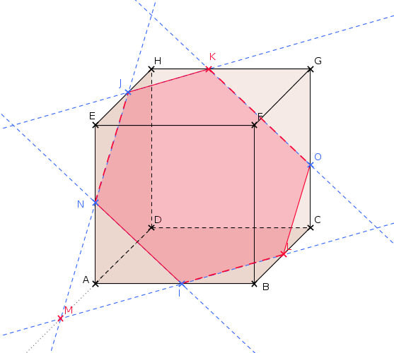

# 3. Přímka a rovina

> Definovat a znázornit vztahy mezi útvary v rovině (rovnoběžnost, kolmost a odchylka přímek, délka úsečky a velikost úhlu, vzdálenosti bodů a přímek). \
> Rozlišit možnosti vzájemné polohy bodů, přímek, přímky a roviny, rovin v prostoru; věty o kolmosti nebo rovnoběžnosti přímek a rovin; rozlišit různá analytická vyjádření rovnice přímky v rovině. \
> Zobrazit jednoduchá tělesa ve volném rovnoběžném promítání. Konstruovat rovinné řezy hranolu a jehlanu.

## Přímka

### Definice

- Někonečně tenká a dlouhá, nekonečně rovná křivka
- Bod a dvourozměrný vektor
- Dva různé body

### Analytické vyjádření v rovině

#### Obecné

- $ax + by + c = 0$
  - $a, b, c \in R; a \ne 0 \lor b \ne 0$

#### Parametrické

- $x = b_x + t \cdot v_x \land y = b_y + t \cdot v_y$
  - $B = [b_x, \ b_y]$ - Bod "počátku" přímky
  - $\vec{v} = (v_x, \ v_y)$ - Směr přímky
  - $t \in R$ - Parametr

#### Směrnicové

- $y = tan(\varphi) \ x + q$
  - $\varphi$ - Orientovaný úhel v průsečíku přímky a první souřadnicové osy
  - $q \in R$

#### Ve vyšších rozměrech

- Existuje pouze parametrické vyjádření

### Vzájemná poloha přímek

#### V rovině

- Rovnoběžky
  - Žádný společný bod
- Totožné
  - Speciální případ rovnoběžnosti
  - Nekonečně mnoho společných bodů
- Různoběžky
  - Různé směry
  - Protínají se v jednom bodě

#### V prostoru

- Rovnoběžné
  - Žádný společný bod
- Totožné
  - Speciální případ rovnoběžnosti
  - Nekonečně mnoho společných bodů
- Různoběžné
  - Leží v jedné rovině
  - Jeden společný bod
- Mimoběžné
  - Neleží v jedné rovině
  - Žádný společný bod

### Odchylka přímek

- Definována pro 2 různoběžné přímky
- Úhel ($\varphi$), který přímky svírají
- Přímky (pokud ne sebe nejsou kolmé) svírají dva různě velké úhly $\implies$ za odchylku se považuje ten menší
- Lze spočítat jako odchylku vektorů příměk (viz [skalární součin](../13/_.md#skal%C3%A1rn%C3%ADm-sou%C4%8Dn))

## Rovina

### Definice

- Nekonečná dokonale rovná plocha
- Bod a trojrozměrný vektor
- Přímka a bod ležící mimo tuto přímku
- Tři body

### Analytické vyjádření v prostoru

#### Parametrické

- $x = b_x + t \cdot v_x \land y = b_y + t \cdot v_y \land z = b_z + t \cdot v_z$
  - $B = [b_x, \ b_y, \ b_z]$ - Bod "počátku" roviny
  - $\vec{v} = (v_x, \ v_y, \ v_z)$ - Směr roviny
  - $t \in R$ - Parametr

#### Obecné

- $ax + by + cz + d = 0$
  - $a, b, c, d \in R; a \ne 0 \lor b \ne 0 \lor c \ne 0$

#### Ve vyšších rozměrech

- Existuje pouze parametrické vyjádření

### Vzájemná poloha rovin v prostoru

#### Dvou rovin

- Rovnoběžné
  - Žádný společný bod
- Totožné
  - Speciální případ rovnoběžnosti
  - Nekonečně mnoho společných bodů
- Různoběžné
  - Nekonečně mnoho společných bodů
  - Průsečíkem je přímka (průsečnice)

#### Tří rovin

- Rovnoběžné
  - Každé dvě jsou rovnoběžné, bez společného bodu
- Rovnoběžné
  - Dvě jsou rovnoběžné a třetí je protíná, vznik dvou průsečnic
- Různoběžné
  - Každá rovina je vůči ostatním různoběžná, vznik tří průsečnic
- Různoběžné
  - Každá rovina je různoběžná, vznik jedné průsečnice
  - Vznik tří průsečnic protínajících se v jednom bodě

## Vzorečky

- Vzdálenost
  - Bodu $A = [a_1; \ a_2]$ od bodu $B = [b_1, b_2]$; $|A \ B| = \sqrt{(a_1 - b_1)^2 + (a_2 - b_2)^2}$
  - Bodu $A = [a_1; \ a_2]$ od přímky $p: ax + by + c = 0$; $|A \ p| = \frac{|a \cdot a_1 + b \cdot a_2 + c|}{\sqrt{a^2 + b^2}}$
  - Bodu $A = [a_1; \ a_2; \ a_3]$ od roviny $\varrho: ax + by +cz + d = 0$; $|A \ \varrho| = \frac{|a \cdot a_1 + b \cdot a_2 + c \cdot a_3 + d|}{\sqrt{a^2 + b^2 + c^2}}$
- Odchylka přímek, rovin...
  - $\vec{u} = (u_1; \ u_2; \ ... \ ; \ u_n)$, $\vec{v} = (v_1; \ v_2; \ ... \ ; \ v_n)$ - Normálové vektory přímek, nebo rovin...
  - $\cos(\omega) = \frac{|u \cdot v|}{|u| \cdot |v|}$

## Volné rovnoběžné promítání

- Způsob promítnutí prostoru do roviny - "průmětny"
- Útvary, ležící v rovině rovnoběžné s průmětnou, se zobrazují ve skutečné velikosti
- Úsečky, které jsou kolmé na průmětnu, se dvakrát zkrátí a promýtnou se pod úhlem $45^\circ$

### Typy rovnoběžného promítání

- a) Pravý nadhled - Viditelná je horní, pravá a přední stěna
- b) Levý podhled - Viditelná je dolní, levá a přední stěna
- c) Pravý podhled - Viditelná je dolní, pravá a přední stěna
- d) Levý nadhled - Viditelná je horní, levá a přední stěna

## Řez hranolu a jehlanu rovinou

- Lze spojovat pouze body ve stejné stěně útvaru
- Dále využívání rovnoběžnosti úseček, osy afinity, ...

 \

