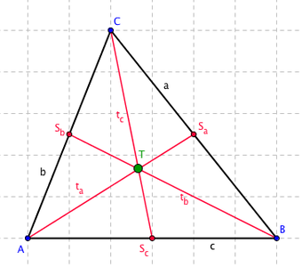
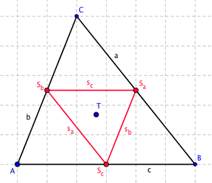
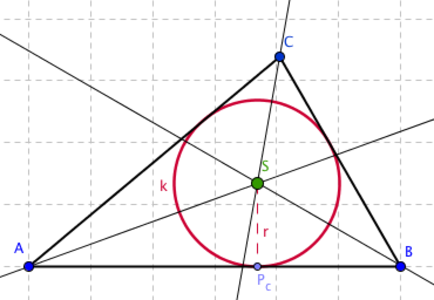
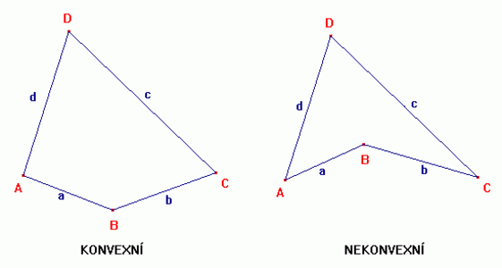

# 4. Trojúhelník a čtyřúhelník

> Definovat základní objekty v trojúhelníku (význačné body, úsečky, přímky, kružnice – využít množiny bodů daných vlastností). \
> Formulovat význačné matematické věty týkající se trojúhelníků (součty úhlů, trojúhelníková nerovnost, věty o shodnosti, Pythagorova věta, Euklidovy věty, trigonometrické vztahy). \
> Klasifikovat základní typy čtyřúhelníků na základě významných vlastností a vyvodit důsledky.

$S$ - Obsah \
$o$ - obvod

## Trojúhelník

- Rovinný útvar tvořen třemi úsečkami a třemi vrcholy
- Strany $AB = c$, $BC = a$, $CA = b$
- Úhly $\alpha + \beta + \gamma = 180^{\circ}$
- $S_\triangle = \frac{a \ v_a}{2}$

### Pojmy

#### Výška

- Kolmice na stranu procházející protějším vrcholem
- Ortocentrum (”Výškoviště”)
  - Průsečík 3 výšek
  - Nemusí být uvnitř trojúhelníku

#### Těžnice

- Spojnice středu strany a protějšího vrcholu
- Těžiště
  - Průsečík 3 těžnic, vždy uvnitř trojúhelníku
  - Dělí těžnice v poměru $1:2$

#### Střední příčka

- Tvoří příčkový trojúhelník, který má identické těžiště s původním trojúhelník

#### Kružnice opsaná

- Střed v průsečíku os stran

#### Kružnice vepsaná

- Střed v průsečíku os úhlů

### Trojúhelníková nerovnost

- Součet délek kterýchkoliv dvou stran je vždy větší než délka strany třetí
  - $|a|+|b| > |c|$
  - $|a|+|c| > |b|$
  - $|c|+|b| > |a|$

### Věty o shodosti trjúhelníků

- "SSS" - Shodují-li se dva trojúhelníky ve všech třech odpovídajících si stranách, pak jsou shodné
- "SUS" - Shodují-li se dva trojúhelníky ve dvou stranách a úhlu jimi sevřeném, jsou shodné
- "USU" - Shodují-li se dva trojúhelníky v jedné straně a v obou úhlech k ní přilehlých, jsou shodné
- "SSU" - Shodují-li se dva trojúhelníky ve dvou stranách a úhlu proti delší z nich, jsou shodné

### Typy trojúhelníků

#### Rovnostranný trojúhelník

- $|a|=|b|=|c|;\ \alpha ,\ \beta, \ \gamma \ = 60^{\circ}$

#### Rovnoramenný trojúhelník

- $|a|=|b| \neq |c|; \ \alpha =\beta \neq \gamma$

#### Ostroúhlý trojúhelník

- $\alpha, \ \beta, \ \gamma < 90^{\circ}$

#### Pravoúhlý trojúhelník

- $\alpha \lor \beta \lor \gamma = 90^{\circ}$
- $a^2 = b^2 + c^2$

#### Tupoúhlý trojúhelník

- $\alpha \lor \beta \lor \gamma > 90^{\circ}$

### Vzorečky

#### Euklidovy věty

- Věta o výšce
  - $v_c^2 = c_a \space c_b$
- Věta o odvěsně
  - $a^2 = c \ c_a$
  - $b^2=c \ c_b$

#### Heronův vzorec

- $a$, $b$, $c$ - délky stran trojúhelníku
- $s =  \frac{a+b+c}{2}$
- $S_\triangle = \sqrt{s(s-a)(s-b)(s-c)}$

#### Trigoniometrie

- Sinová věta
  - $\frac{a}{\sin{\alpha}} = \frac{b}{\sin{\beta}} = \frac{c}{\sin{\gamma}} = 2r $
    - $r$ - poloměr kružnice opsané
- Kosinová věta
  - $a^2 = b^2 + c^2 - 2bc \cdot \cos{\alpha}$
  - $b^2 = a^2 + c^2 - 2ac \cdot \cos{\beta}$
  - $c^2 = b^2 + a^2 - 2ab \cdot \cos{\gamma}$
- Tangentová věta
  - $\frac{a-b}{a+b}=\frac{\tan(\frac{a-\beta}{2})}{\tan(\frac{\alpha+\beta}{2})}$

## Čtyřúhelník

- Rovinný útvar tvořen 4 úsečkami a 4 vrcholy
- Součet vnitřních úhlů je $360^{\circ}$

## Typy čtyřúhelníků

#### Rovnoběžníky

- $a = c, \ a|c; \ b = d, \ b|d$
- $S = ab \cdot \sin{\alpha}$
- Pravoúhelníky
  - Všechny úhly pravé
  - Čtverec
    - $\alpha, \ \beta, \ \gamma, \ \delta = 90^{\circ}; \ a = b = c = d $
    - $S_\square = a^2; \ o = 4a;\ u = \sqrt{2}*a$
  - Obdelník
    - $\alpha,\ \beta,\ \gamma,\ \delta = 90^{\circ} ; \ a = c; \ b = d$
    - $S = ab; \ u = \sqrt{a^2 + b^2}$
- Kosoúhelníky
  - Kosočtverec
    - Všechny strany stejně dlouhé
  - Kosodelník
    - Sousední strany různě dlouhé

#### Lichoběžníky

- $a\|b$
- $S = \frac{a+c}{2} * v$

#### Různoběžníky

- $a \not \Vert c,\ b \not \Vert d$

### Konvexita

- Mnohoúhelník je konvexní $\iff$ jsou všechny jeho vnitřní úhly menší než $180^{\circ}$
- Úsečka mezi každými 2 body konvexního mnohoúhelníku je v něm celá obsažena v tělesu $t$

