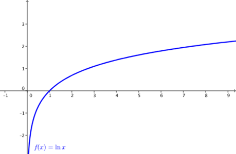

# 9. Logaritmické funkce a rovnice

> Zavést logaritmickou funkci jako funkci inverzní k funkci exponenciální. \
> Zapsat předpis, zakreslit graf a popsat vlastnosti logaritmické funkce s ohledem na možné hodnoty základu. \
> Popsat a použít metody řešení exponenciálních a logaritmických rovnic a jednoduchých nerovnic.

## Logaritmická funkce

### Definice

- Předpis: $f(x) : y = \log_a{x} + c$
  - $a \in R^+ \setminus\{1\}$
  - $c \in R$

### Vlastnosti

- Logaritmus je exponent, na který musíme umocnit základ $a$, abychom získali argument $x$
  - $y = \log_a{x} \iff a^y = x$
- $D(f)= R^+; \ H(f) = R$
- Prostá, spojitá
- Prochází body $[1; \ 0]$ a $[a + c; \ 1]$
- Derivace - $(\log_ax)' = \frac{1}{x \cdot \ln a}$

#### Monotonie

- Nemá maximum, minimum
- $\text{infimum}(f) = -\infty$; $\text{supremum}(f) = \infty$
- Když $a < 1$
  - Klesající funkce

- - Když $a > 1$
  - Rostoucí funkce

### Vztah s exponenciální funkcí

- Jsou navzájem inverzní: $f: y = a^x, f^{-1}: y = \log_a{x} \implies \log_a{a^x} = x$
- Grafy jsou symetrické podle přímky $y = x$

### Přirozený logaritmus

- $f(x): y = \log_e{x} = \ln{x}$
- Tečna v bodě $A = [0; 1]$ je $p: y = x +1$
- Definice limitou - $\ln{x} = \lim\limits_{n \to \infty} n \ (\sqrt[n]{x} - 1)$
- Derivace - $(\ln{x})'= \frac{1}{x}$

## Logaritmická rovnice

- $\log_a{\ f(x)} = \log_a{\ g(x)}$
- Pokud $a = b \implies f(x) = g(x)$

#### Metody řešení

- Zexponenciálování
- Substituce

## Vzorečky

- $\log_aa = 1 \quad log_a1 = 0$
- $\log_a (x^r) = r \cdot \log_ax \quad \log_a(\sqrt[r]{x})= \frac 1 r \log_a(x)$
- $\log_axy = \log_ax + \log_ay$
- $\log_a \frac x y = \log_a x - \log_a y$
- $a^{\log_a x} = \log_a a^x = x \quad  \exp \ln x = \ln \exp x =x$
- $\log_a x= \frac{1}{\log_x a}$
- $\log_a x = \frac{\log_n x}{\log_n a} = \frac{\ln x}{\ln a}$
