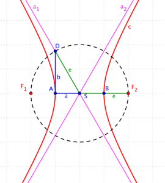
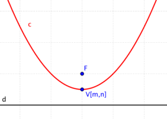
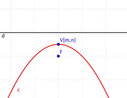
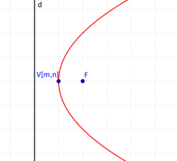
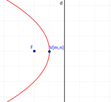

# 14. Kuželosečky, elipsa

> Vysvětlit vztah mezi řezy kužele a vznikem jednotlivých křivek. Elipsa jako množina bodů daných vlastností. Charakterizovat a načrtnout elipsu, popsat vlastnosti, zapsat a rozlišit možná analytická vyjádření rovnice elipsy; rozlišit vzájemné polohy přímky a elipsy.

## Definice

- Kuželosečka je křivka, která vznikne průnikem roviny s pláštěm rotačního kuželu (rovina neprochází vrcholem kuželu)

## Kružnice

- Vznikne průnikem pláště kuželu s rovinou kolmou na osu symetrie rotačního kuželu
- Viz otázka Kružnice

## Elipsa

### Definice

- Vznikne průnikem pláště kuželu s rovinou, která svírá s osou rotačního kuželu úhel menší než $90°$ a větší než polovina vrcholového úhlu kuželu
- Množina všech bodů s konstatním součetem vzdáleností od dvou bodů (ohnisek)

- Elipsa $m$
- Body $E$, $F$ - Ohniska elipsa $l$
- $k \in R^+$ - Konstanta
- Pro bod $X$ elipsy $m$ platí $|XE| + |XF| = k$;

### Pojmy

- Hlavní vrcholy - body $A$ a $B$
- Vedlejší vrcholy - body $C$ a $D$
- Střed - Bod $S$ ve středu úsečky $|EF|$
- Hlavní osa - Přímka, která prochází hlavními vrcholy
- Vedlejší osa - Přímka, která prochází vedlejšími vrcholy
- Hlavní poloosa ($a$) - Úsečka, která spojuje hlavní vrchol a střed ($|AS|$ a $|BS|$)
- Vedlejší poloosa ($b$) - Úsečka, která spojuje vedlejší vrchol a střed ($|CS|$ a $|DS|$)
- Excentricita (výstřednost) - $e$
  - Vzdálenost ohnisek od středu elipsy
  - $e = \frac{|EF|}{2} = |ES| = |FS|$
  - $e = \sqrt{a^2 - b^2}$

### Analytické vyjádření

- $S = [m; \ n]$ - Střed
- $a$ - Délka hlavní poloosy
- $b$ - Délka vedlejší poloosy
- Hlavní osa rovnoběžná s $o_x$ - $\frac{(x - m)^2}{a^2} + \frac{(y - n)^2}{b^2} = 1$
- Hlavní osa rovnoběžná s $o_y$ - $\frac{(x - m)^2}{b^2} + \frac{(y - n)^2}{a^2} = 1$

### Parametrické vyjádření

- $t \in <0, \ 2\pi>$ - parametr
- $x = a \cdot \cos{t}$
- $y = b \cdot \sin{t}$

### Vzorečky

- Polára z body $B = [x_0; \ y_0]$: $\frac{(x - m)(x_0 - m)}{a^2} + \frac{(y - n)(y_0 - n)}{b^2} = 1$
- Obsah - $S = \pi a b$
- Obvod - $o = 4 a E(e)$; $E$ - Úplný eliptický integrál druhého druhu

## Hyperbola

- Vznikne průnikem pláště kuželu s rovinou, která svírá s osou rotačního kuželu úhel menší než než polovina vrcholového úhlu kuželu - rovina je roznoběžná se dvěmi povrchovými přímkami kuželu
- Množina všech bodů s konstantním rozdílem vzdáleností od dvou bodů (ohnisek)

- Hyperbola $c$
- Body $F_1$, $F_2$ - Ohniska hyperboly $c$
- $k \in R^+$ - Konstanta
- Pro bod $X$ hyperboly $c$ platí $|F_1| - |F_2| = k$;

### Pojmy

- Střed - Bod $S$ ve středu úsečky $|F_1 F_2|$
- Hlavní osa - Přímka, která prochází body ohnisky
- Vedlejší osa - Kolmice k hlavní ose v středu
- Vrcholy hyperboly - Průsečíky hyperboly s hlavní osou (body $A$; $B$)
- Hlavní poloosa ($a$) - Úsečka, která vrchol hyperboly a střed ($|AS|$ a $|BS|$)
- Vedlejší poloosa ($b$) - Úsečka, která spojuje vedlejší vrchol a střed ($|CS|$ a $|DS|$)
- Asymptoty ($a_1$; $a_2$)

### Analytické vyjádření

- $S = [m; \ n]$ - Střed
- $a$ - Délka hlavní poloosy
- $b$ - Délka vedlejší poloosy
- Hlavní osa rovnoběžná s $o_x$ - $\frac{(x - m)^2}{a^2} - \frac{(y - n)^2}{b^2} = 1$
- Hlavní osa rovnoběžná s $o_y$ - $\frac{(x - m)^2}{b^2} - \frac{(y - n)^2}{a^2} = 1$

### Vzorečky

- Polára z body $B = [x_0; \ y_0]$: $\frac{(x - m)(x_0 - m)}{a^2} + \frac{(y - n)(y_0 - n)}{b^2} = 1$
- Rovnice asymptot: $y - n = \pm \frac{b}{a}(x - m)$

## Parabola

### Definice

- Vznikne průnikem pláště kuželu s rovinou, která je rovnoběžná s povrchovou přímkoupláště kuželu
- Množina všech bodů s konstantním vzdáleností od bodu (ohniska) a přímky (řídící přímky), na které bod neleží

- Parabola $c$
- Bod $F$ - Ohnisko paraboly $c$
- $d$ - Řídící přímka paraboly $c$
- $|XF| = |XE|$

### Pojmy

- Osa paraboly (přímka $FD$) - Kolmá k řídící přímce, prochází ohniskem
- Vrchol paraboly (bod $V$)
- Parametr paraboly ($p = |FD|$) - Vzdálenost ohniska od řídící přímky

### Analytické vyjádření

- Graf kvadratické funkce
- $V = [m; \ n]$ - Vrchol
- Čtyři různé případy
  - Osa rovnoběžná s $o_y$, zdola omezená
  - $(x - m)^2 = 2 p (y - n)$
  - $F = [m; \ n + \frac{p}{2}]$

- - Osa rovnoběžná s $o_y$, shora omezená
  - $(x - m)^2 = -2 p (y - n)$
  - $F = [m; \ n - \frac{p}{2}]$

- - Osa rovnoběžná s $o_x$, zleva omezená
  - $(y - n)^2 = 2 p (x - m)$
  - $F = [m + ;\frac{p}{2} \ n]$

- - Osa rovnoběžná s $o_x$, zprava omezená
  - $(y - n)^2 = -2 p (x - m)$
  - $F = [m - \frac{p}{2}; \ n]$

## Degenerované kuželosečky

Za kuželosečku bývá často považován také průnik kuželové plochy s rovinou procházející vrcholem kuželové plochy. Takovéto kuželosečky označujeme jako degenerované (nevlastní, singulární), neboť podle polohy roviny a osy kuželové plochy dochází k redukci kuželosečky na bod, přímku nebo dvě přímky. ([wikipedie](https://cs.wikipedia.org/wiki/Ku%C5%BEelose%C4%8Dka#Degenerovan%C3%A9_ku%C5%BEelose%C4%8Dky))
