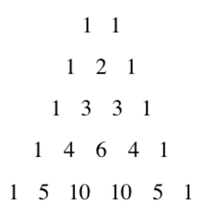

# 18. Kombinatronika

### Základní pojmy

- Kombinatorické pravidlo součtu

  - Mějme množiny A, B, které nemají žádný společný prvek
  - Počet všech možných způsobů výběru jednoho prvku ze sjednocení $A ∪ B = |A| + |B|$
  - Příklad:
    - Máme 6 červených míčků a 8 modrých míčků. Tyto míčky vysypeme do jednoho osudí. Kolik máme celkem možností, když budeme losovat jeden míček?
    - Na začátku jsme měli množinu červených míčků, označme jako množinu A, pak množinu modrých míčků, označme B. Tyto množiny jsou disjunktní, tzn., že nemají žádný stejný míček. Chceme vylosovat jeden míček, takže máme celkem $|A| + |B| = 6 + 8 = 14$ možností. To je celé.

- Kombinatorické pravidlo součinu

  - Příklad
    - Mějme množiny, Z a M. Množina Z obsahuje tři ženy a množina M čtyři muže. Nyní se ptáme, kolik různých párů muž—žena můžeme z těchto množin vytvořit?
    - Vezmeme jednu ženu, Katku, a postupně k ní přiřadíme všechny muže. Dostaneme tak 4 různé páry, protože k ní můžeme přiřadit celkem 4 různé pány. Totéž uděláme pro zbývající dvě ženy, ty také vytvoří vždy další 4 páry. Máme celkem $4 + 4 + 4 = 12 \ (3 \cdot 4)$ párů.

- Faktoriál

  - Faktoriál čísla $n$ je číslo rovné součinu všech přirozených čísel menších nebo rovných $n$

  - $n \in N^0 $
  - $n! = {\displaystyle \prod_{i=1}^{n} i} = n \cdot (n - 1)!; \space 0! = 1$

- Kombinační číslo

  - Počítá počet k-členných kombinací z n prvků

  - $n, k \in Z$
  - $\binom{n}{k} = \frac{n!}{(n-k)! \cdot k!}$
  - $\binom{n}{0} = \binom{n}{n} = \binom{0}{0} = 1$
  - $\binom{n}{1} = n$
  - $\binom{n}{n-k} = \binom{n}{k}$
  - $\binom{n}{k} + \binom{n}{k+1} = \binom{n+1}{k+1}$

### Vzorečky

- Variace

  - Z množiny vybíráme určitý počet prvků
  - **Záleží** na pořadí, v jakém prvky vybíráme

  - $n - \text{počet prvků množiny}$
  - $k - \text{počet vybíraných prvků}$
  - $V(k,n) = \frac{n!}{(n-k)!}$

- Variace s opakováním

  - Jako variace, ale vybírané prvky se **mohou opakovat**
  - **Záleží** na pořadí, v jakém prvky vybíráme
  - $n - \text{počet prvků množiny}$
  - $k - \text{počet vybíraných prvků}$
  - $V'(k,n) = n^k$

- Permutace

  - Speciální případ variace, kdy vybíráme všechny prvky množiny ($n = k$)
  - **Záleží** na pořadí, v jakém prvky vybíráme

  - $n - \text{počet prvků množiny}$
  - $P(n) = V(n,n) = n!$

- Permutace s opakováním

  - $P'(k_1,k_2,...,k_n)=\frac{(k_1 + k_2 + \cdot \cdot \cdot + k_n)!}{k_1! \cdot k_2! \cdot \cdot \cdot \cdot \cdot k_n}$

- Kombinace

  - Z množiny vybíráme určitý počet prvků
  - **Nezáleží** na pořadí, v jakém tyto prvky vybíráme

  - $n - \text{počet prvků množiny}$
  - $k - \text{počet vybíraných prvků}$
  - $C(k,n) = \binom{n}{k} = \frac{V(k,n)}{k!} = \frac{n!}{(n-k)! \cdot k!}$

- Kombinace s opakováním

  - Jako kombinace, ale vybírané prvky se **mohou opakovat**
  - **Nezáleží** na pořadí, v jakém prvky vybíráme

  - $n - \text{počet prvků množiny}$
  - $k - \text{počet vybíraných prvků}$
  - $C'(k,n) = \binom{n+k-1}{n-1} = \binom{n+k-1}{k}$

### Binomická věta

- Definice

  - $(a+b)^2 = a^2 + 2ab+c^2$
  - $(a+b)^3 = a^3 + 3a^2b+3ab^2 + b^3$
  - $(a+b)^n = \sum_{k=0}^n \binom{n}{k}a^{n-k}b^k; n \in N$

- Pascalův trojúhelník

