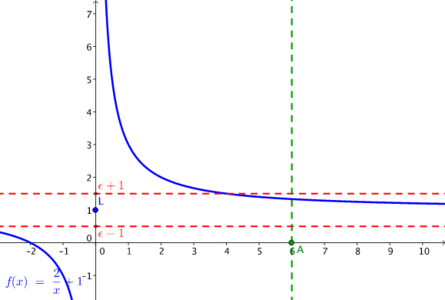

# 22. Limita funkce

> Definovat pojmy vlastní a nevlastní limita posloupnosti, konvergentní a divergentní posloupnost. Využít věty o limitách posloupnosti k výpočtu limity posloupnosti. Definovat pojem řada, určit podmínky konvergence nekonečné geometrické řady.

### Pojmy

- Epsilon okolí bodu
  - Pro $r \in R;$ $\epsilon > 0$ je otevřený interval $(r-\epsilon, \ r+\epsilon)$ epsilon okolí bodu $r$
  - Značí se $U(a,\epsilon)$
  - Příklad: $U(5, 2)$

- Redukované (prstencové) epsilon okolí bodu
  - Pro $r \in R;\space \epsilon > 0$ je $(r-\epsilon,r) \cup (r,r+\epsilon)$
  - Značí se $R(a, \epsilon)$
- Hromadný bod množiny
  - Prvek $a \in R$ je hromadným bodem množiny $M \subseteq R$ pokud platí, že v každém jeho redukovaném okolí, jakkoliv malém, leží nějaký bod množiny $M$
  - $a \in R; \ M \subseteq R$
  - $\forall \epsilon > 0 : R(a, \epsilon) \cap M \not = \emptyset $

### Definice limity ve vlastním bodě

- $f - \text{funkce}$
- $x_0 - \text{Hromadný bod} \ D(f)$
- $x_0 \in R$ je hromadný bod definičního oboru funkce $f$
- $L \in R$ je limitou funkce $f$ v bodě $x_0$ $\iff$
- $\lim\limits_{a \to x_0}f(a) = L \iff \\ (\forall \epsilon > 0), \ (\exists \delta > 0), \ (\forall x; \ x \in D(f) \land x \in R(x_0,\delta)), \ (0 < |x - x_0| < \delta \implies |f(x) - L| < \epsilon)$
- Nebo: $\lim\limits_{a \to x_0}f(a) = L \iff \\ \forall \epsilon > 0; \ \exists \delta > 0; \ (\forall x; \ x \in D(f) \land x \in R(x_0, \ \delta))\implies f(x) \in U(L, \epsilon)$

### Definice limity v nevlastním bodě

- Hledáme limitu funkce, když se blížíme k nekonečnu

- $\infty$ - Hromadný bod funkce $f$
- Pro $+\infty$
  - $\lim\limits_{x \to \infty} f(x) = L \iff$
  - $\forall \epsilon \in R^+; \ \exists A \in R; \ (\forall x; x \in D(f) \land x > A) : |f(x) - L| < \epsilon $
- Pro $-\infty$
  - $\lim\limits_{x \to -\infty} f(x) = L \iff$
  - $\forall \epsilon \in R^+; \ \exists A \in R; \ (\forall x; x \in D(f) \land x < A) : |f(x) - L| < \epsilon$

### Spojitost funkce

- Funkce $f$ je spojitá, když “se její hodnoty mění plynule, lze nakreslit jedním tahem”
- Funkce $f$ je spojitá v bodě $x$ $\iff$ $\lim\limits_{a \to x} f(a)=f(x)$

### L'Hospitalovo pravidlo

- Lze někdy použít pro výpočet limit ve tvaru podílu
- $f, \ g - \text{funkce}$
- $f(x_0) = g(x_0) = 0 \implies \lim\limits_{x \to x_0} \frac{f(x)}{g(x)} = \lim\limits_{x \to x_0} \frac{f'(x)}{g'(x)}$
- Pokud $\lim\limits_{x \to x_0} \frac{f'(x)}{g'(x)}$ neexistuje, neznamená to nutně, že neexistuje ani $\lim\limits_{x \to x_0} \frac{f(x)}{g(x)}$

### Vzorečky

- $\lim\limits_{x \to a} f(x) = A,\ \ \ \lim_{x \to a} g(x) = B$
- $\lim\limits_{x \to a}[f(x)+g(x)] = \lim_{x \to a}f(x) + \lim_{x \to a}g(x)=A+B$
- $\lim\limits_{x \to a}[f(x)\cdot g(x)]=\lim_{x \to a}f(x) \cdot \lim_{x \to a} g(x)=A\cdot B$
- $\lim\limits_{x \to a}[\frac{f(x)}{g(x)}]= \frac{\lim_{x \to a} f(x)}{\lim_{x \to a}g(x)} =\frac{A}{B}$
- $\lim\limits_{x \to a}c \cdot f(x)=c \cdot A$
