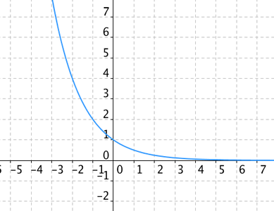
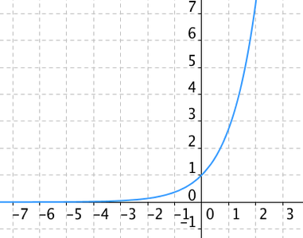

// # 8. Exponenciální funkce a rovnice

> Definovat exponenciální funkci, zakreslit graf a stanovit vlastnosti funkce. Řešit početně i graficky příslušné rovnice a nerovnice. Ukázat spojitost s logaritmickou funkcí.

### Exponenciální funkce

- Předpis: $f(x) : y = a^x + c;\ a \in (R^+ \setminus \{1\});\ c \in R$
- $D(f) = R; \ H(f) = (0,\infty)$
- Prostá, spojitá
- Prochází body $[0; \ 1 + c]$ a $[1; \ a + c]$
- Derivace - $(a^x)' = \ln a \cdot a^x$

- Monotonie
  - Nemá maximum, minimum
  - $\text{infimum}(f) = 0; \ \text{supremum}(f) = \infty$
  - Když $a < 1$
    - Klesající

- - Když $a>1$
    - Rostoucí

### Přirozená exponenciální funkce

- $f(x):y = e^x$
- $a^x = e^{x \ln{a}}$
- Definice limitou - $e^x = \lim\limits_{n  \to \infty} \Big( 1 + \frac x n \Big)^n$
- Sklon roven hodnotě funkce v bodě - $(e^x)' = e^x$

### Vztah s logaritmickou funkcí

- Jsou navzájem inverzní: $f: y = a^x, \ f^{-1}: y = \log_a{x} \implies \log_a{a^x} = x$
- Grafy jsou symetrické podle přímky $y = x$

### Exponenciální rovnice

- $a^{f(x)} = b^{g(x)}$
- Pokud $a = b \implies f(x) = g(x)$
- Zlogaritmování $\log{a}^{f(x)} = \log {b}^{g(x)} \implies f(x) \cdot \log a = g(x) \cdot \log b$
- Substituce: $a^{2x} + a^x + c = 0; \ a^x = y \implies y^2 + y + c = 0$

### Vzorečky

- $a^{-x} = \frac {1}{ a^x}, a^x = \frac{1}{a^{-x}}$
- $a^x \cdot a^y = a^{x + y}$
- $\frac{a^x}{a^y} = a^{x - y}$
- $(ab)^x = a^x b^x$
- $(a^x)^y = a^{xy}$
- $a^{\frac x y} = \sqrt[y]{a^x} = (\sqrt[y]a)^x$
